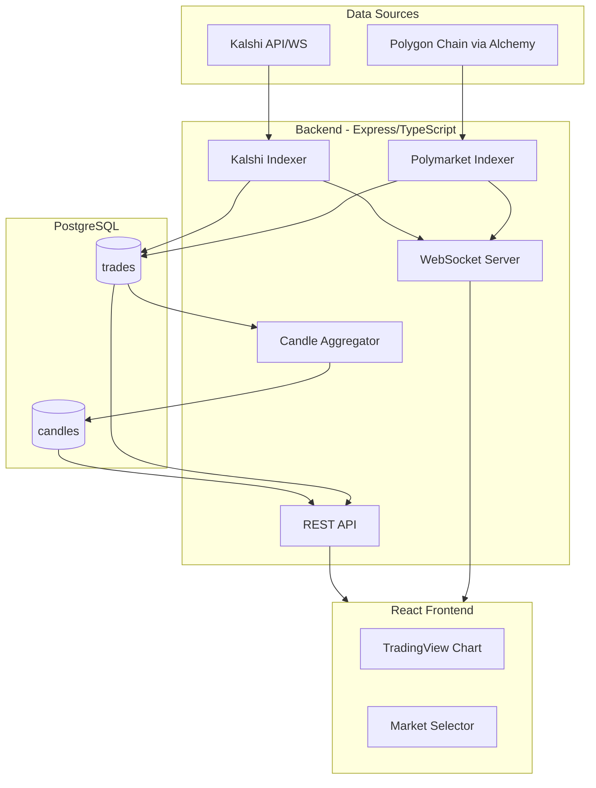

# Prediction Market Trade Indexer - Implementation Plan

## Architecture Overview



---

## Phase 1: Project Setup and Database Schema

**Goal:** Initialize project structure, Docker setup, and database tables.

### File Structure

```javascript
dawn-trial-2/
├── backend/
│   ├── src/
│   │   ├── db/
│   │   │   ├── client.ts          # Postgres client
│   │   │   └── migrations/        # SQL migration files
│   │   ├── indexers/
│   │   ├── api/
│   │   ├── types/
│   │   │   └── index.ts           # Trade, Candle interfaces
│   │   └── index.ts               # Entry point
│   ├── package.json
│   └── tsconfig.json
├── frontend/
│   ├── src/
│   ├── package.json
│   └── vite.config.ts
├── docker-compose.yml
├── .env.example
└── README.md
```


### Database Schema

```sql
-- trades table
CREATE TABLE trades (
    id SERIAL PRIMARY KEY,
    exchange VARCHAR(20) NOT NULL,      -- 'polymarket' | 'kalshi'
    market_id VARCHAR(255) NOT NULL,
    price DECIMAL(20, 10) NOT NULL,
    quantity DECIMAL(20, 10) NOT NULL,
    side VARCHAR(10) NOT NULL,           -- 'buy' | 'sell'
    timestamp TIMESTAMPTZ NOT NULL,
    tx_hash VARCHAR(66),                 -- Only for Polymarket
    created_at TIMESTAMPTZ DEFAULT NOW(),
    UNIQUE(exchange, market_id, timestamp, tx_hash)
);

-- candles table (pre-aggregated)
CREATE TABLE candles (
    id SERIAL PRIMARY KEY,
    exchange VARCHAR(20) NOT NULL,
    market_id VARCHAR(255) NOT NULL,
    interval VARCHAR(5) NOT NULL,        -- '1s' | '1m' | '1h'
    open_time TIMESTAMPTZ NOT NULL,
    open DECIMAL(20, 10) NOT NULL,
    high DECIMAL(20, 10) NOT NULL,
    low DECIMAL(20, 10) NOT NULL,
    close DECIMAL(20, 10) NOT NULL,
    volume DECIMAL(20, 10) NOT NULL,
    UNIQUE(exchange, market_id, interval, open_time)
);

-- Indexes for fast queries
CREATE INDEX idx_trades_lookup ON trades(exchange, market_id, timestamp DESC);
CREATE INDEX idx_candles_lookup ON candles(exchange, market_id, interval, open_time DESC);
```

---

## Phase 2: Kalshi Indexer

**Goal:** Connect to Kalshi WebSocket, receive live trades, and store them.Starting with Kalshi because it's API-based and simpler to implement. This validates the database schema works before tackling on-chain data.

### Key Steps

1. Connect to Kalshi WebSocket: `wss://api.pond.dflow.net/trades`
2. Parse incoming trade messages
3. Transform to our Trade interface
4. Insert into `trades` table with UPSERT
5. Emit trade events for WebSocket broadcasting

### Key File: [`backend/src/indexers/kalshi-indexer.ts`](backend/src/indexers/kalshi-indexer.ts)

---

## Phase 3: Polymarket Indexer

**Goal:** Index trades from the Polymarket CTF Exchange contract on Polygon.

### Contract Details

- **CTF Exchange:** `0x4bFb41d5B3570DeFd03C39a9A4D8dE6Bd8B8982E`
- **Event to track:** `OrderFilled` or similar trade events
- **Chain:** Polygon (137)

### Key Steps

1. Connect to Alchemy WebSocket for Polygon
2. Subscribe to contract events using `eth_subscribe`
3. Decode event logs to extract trade data (price, quantity, side, market)
4. Insert into `trades` table
5. Emit trade events for WebSocket broadcasting

### Key File: [`backend/src/indexers/polymarket-indexer.ts`](backend/src/indexers/polymarket-indexer.ts)

---

## Phase 4: Candlestick Aggregation

**Goal:** Aggregate trades into OHLC candles for 1s, 1m, and 1h intervals.

### Aggregation Strategy

Real-time aggregation as trades arrive:

1. When a trade is inserted, update the current candle for each interval
2. Use PostgreSQL UPSERT to atomically update OHLC values
3. On new interval boundary, a new candle row is created automatically
```sql
-- Example UPSERT for candle update
INSERT INTO candles (exchange, market_id, interval, open_time, open, high, low, close, volume)
VALUES ($1, $2, $3, $4, $5, $6, $7, $8, $9)
ON CONFLICT (exchange, market_id, interval, open_time)
DO UPDATE SET
    high = GREATEST(candles.high, EXCLUDED.high),
    low = LEAST(candles.low, EXCLUDED.low),
    close = EXCLUDED.close,
    volume = candles.volume + EXCLUDED.volume;
```


### Key File: [`backend/src/services/candle-aggregator.ts`](backend/src/services/candle-aggregator.ts)

---

## Phase 5: REST API

**Goal:** Serve candles and trades via HTTP endpoints.

### Endpoints

| Method | Path | Description ||--------|------|-------------|| GET | `/candles` | Get OHLC candles for a market || GET | `/trades` | Get latest trades for a market |

### Query Parameters

- `exchange`: `polymarket` or `kalshi` (required)
- `marketId`: Market identifier (required)
- `interval`: `1s`, `1m`, or `1h` (for /candles)
- `start`, `end`: ISO timestamps for time range
- `limit`: Number of results (default 100)

### Response Format

```json
{
  "data": [
    {
      "openTime": "2024-12-24T10:00:00Z",
      "open": "0.55",
      "high": "0.58",
      "low": "0.54",
      "close": "0.57",
      "volume": "1250.5"
    }
  ]
}
```


### Key Files

- [`backend/src/api/routes/candles.ts`](backend/src/api/routes/candles.ts)
- [`backend/src/api/routes/trades.ts`](backend/src/api/routes/trades.ts)

---

## Phase 6: WebSocket Server

**Goal:** Stream live trades to connected frontend clients.

### Protocol

**Client subscribes:**

```json
{ "action": "subscribe", "exchange": "kalshi", "marketId": "KXBTC-24DEC31" }
```

**Server broadcasts:**

```json
{ "type": "trade", "data": { "exchange": "kalshi", "marketId": "...", "price": "0.55", ... } }
```


### Architecture

- Use `ws` library alongside Express
- Maintain a map of subscriptions: `Map<string, Set<WebSocket>>`
- When indexers receive trades, broadcast to relevant subscribers

### Key File: [`backend/src/websocket/server.ts`](backend/src/websocket/server.ts)

---

## Phase 7: Frontend

**Goal:** Display candlestick charts with real-time updates.

### Features

1. Market selector dropdown (hardcode a few known markets initially)
2. Exchange toggle (Polymarket / Kalshi)
3. Interval selector (1s / 1m / 1h)
4. TradingView Lightweight Charts candlestick display
5. WebSocket connection for live updates

### Key Components

- [`frontend/src/components/Chart.tsx`](frontend/src/components/Chart.tsx) - TradingView chart wrapper
- [`frontend/src/components/MarketSelector.tsx`](frontend/src/components/MarketSelector.tsx) - Market/exchange selection
- [`frontend/src/hooks/useWebSocket.ts`](frontend/src/hooks/useWebSocket.ts) - WebSocket connection hook
- [`frontend/src/App.tsx`](frontend/src/App.tsx) - Main layout

---

## Recommended Build Order

| Phase | Est. Time | Dependency ||-------|-----------|------------|| 1. Setup + DB | 1 hour | None || 2. Kalshi Indexer | 1.5 hours | Phase 1 || 3. Polymarket Indexer | 2 hours | Phase 1 || 4. Candle Aggregation | 1 hour | Phase 2 or 3 || 5. REST API | 1 hour | Phase 4 || 6. WebSocket Server | 1 hour | Phase 2 or 3 || 7. Frontend | 2 hours | Phase 5 + 6 |**Total:** ~10 hours---

## Getting Started

After approval, we'll begin with Phase 1:

1. Initialize `backend/` with TypeScript, Express, and dependencies